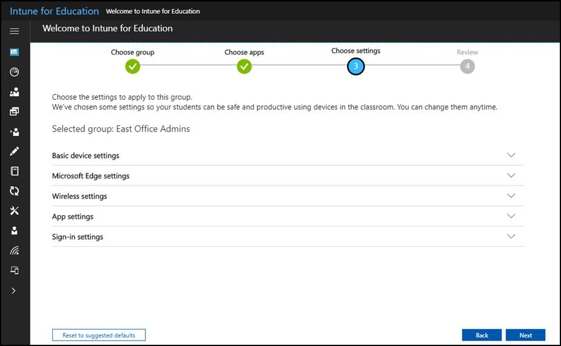

---
# required metadata

title: Express Configuration
titleSuffix: Intune for Education
description: Use Express Configuration to set up your groups in Intune for Education.
keywords:
author: lenewsad
ms.author: lanewsad
manager: angrobe
ms.date: 01/17/2018
ms.topic: article
ms.prod:
ms.service: microsoft-intune
ms.technology:
ms.assetid: af5d35ee-84f5-4245-a441-671600bcc376
searchScope:
 - IntuneEDU

# optional metadata

#ROBOTS:
#audience:
#ms.devlang:
#ms.reviewer: travisj
#ms.suite: ems
#ms.tgt_pltfrm:
#ms.custom: intune-education

---

# Express Configuration in Intune for Education

  

Express Configuration enables you to assign settings and apps to users and devices. The launch tile for the step-by-step walkthrough is found on the front page of the [Intune for Education portal](https://intuneeducation.portal.azure.com). 

As you click through each step, you'll see that most of the Windows or iOS settings are already configured. These configurations are the default values and are set as recommendations. Recommended OS-specific apps are also preselected. Change the default selections as needed for your school.

Return to Express Configuration anytime you want to make changes to a group's settings or apps. 

##Start the configuration
This section describes how to complete the steps in Express Configuration. To get the most out of the Express Configuration, make sure you've synced your school data or created groups in Azure AD. 

1. Sign in to the Intune for Education portal.
2. On the dashboard, click Launch Express Configuration.

If iOS configurations are disabled when you launch Express Configurations:
1. From the dashboard select See all > iOS device management.
2. Upload an Apple MDM Push Certificaate.
3. Register an Apple Device Enrollment Program (DEP) token.

### Choose a group to configure  //lenewsad Are changes implemented as each step is complete? I see the little notifications that say "app added" etc. 

Default groups are included with your Intune for Education subscription. They are populated with the details of your school records. Default groups include:
    * All Devices
    * All Users
If you used SDS to import your school's records, you'll also see:      
    * All Teachers
    * All Students 

We recommend that you start with the **All Users** group, and assign the settings that all users must have. For example, assign settings such as password requirements or pop-up restrictions in Microsoft Edge.

  

Click the expand/collapse arrow to view or hide all groups. Remember, if you configure a top-level group, all settings you apply to that group will be inherited by its subgroups.

### Choose apps

The types of apps that you can provision to devices include:
* [Web apps](how-to-add-apps.md#add-web-apps)
* [Desktop apps](how-to-add-apps.md#add-desktop-apps)
* [Microsoft Store for Education apps](acquire-store-apps.md)
* [Apple VPP apps]()

  

Intune for Education also displays [popular apps from the Microsoft Store for Education](how-to-add-apps.md#add-popular-apps) from across all Intune for Education users.

### Choose settings
Express Configuration shows you common settings for devices and users in Intune. Settings are separated into OS-specific categories: Windows Device Settings and iOS Device Settings.

The default settings are preset with recommended values. You don't have to make any modifications if you want to stick with the recommendations. 

  

You can change Express Configuration selections at any time to fit any changes you need to make, and customize your settings even further using the full [list of settings available as part of Intune for Education](available-settings.md).

### Review settings

Before committing, review your apps and settings selections. Click Back to make changes. When your review is complete, click **Save**.

  Not up to date: 

Not up to date: After you choose **Finish**, you can **Configure more groups** or be **All done**.

  

## Next Steps
LEN: What actually happens when you are done? 
When you are done, you will be taken to the Intune for Education dashboard where you can continue to manage your devices, users, and apps. 

- [Find out more about the settings available in the full management experience in Intune](https://docs.microsoft.com/intune/deploy-use/manage-settings-and-features-on-your-devices-with-microsoft-intune-policies)
