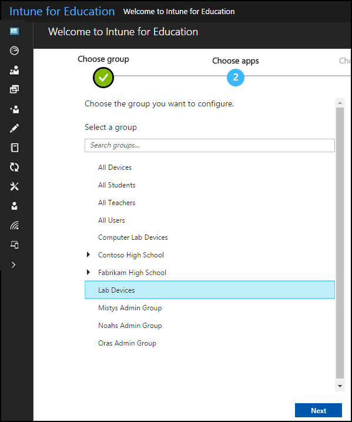

---
# required metadata

title: Express Configuration
titleSuffix: Intune for Education
description: Use Express Configuration to set up your groups in Intune for Education.
keywords:
author: lenewsad
ms.author: lanewsad
manager: dougeby
ms.date: 07/23/2018
ms.topic: article
ms.prod:
ms.service: microsoft-intune
ms.technology:
ms.assetid: af5d35ee-84f5-4245-a441-671600bcc376
searchScope:
 - IntuneEDU

# optional metadata

#ROBOTS:
#audience:
#ms.devlang:
#ms.reviewer: travisj
#ms.suite: ems
#ms.tgt_pltfrm:
#ms.custom: intune-education

---

# Express configuration in Intune for Education

  

Express Configuration enables you to assign settings and apps to users and devices. The launch tile for the step-by-step walkthrough is found on the front page of the [Intune for Education portal](https://intuneeducation.portal.azure.com). 

As you click through each step, you'll see that most of the Windows or iOS settings are already configured. These configurations are the default values and are set as recommendations. Recommended OS-specific apps are also preselected. Change the default selections as needed for your school. 

Return to express configuration anytime you want to make changes to a group's settings or apps. 

## Launch express configuration
This section describes how to complete the steps in express configuration. To get the most out of express configuration, make sure you've synced your school data or created groups in Azure AD. 

1. Sign in to the Intune for Education portal.
2. On the dashboard, click **Launch Express Configuration**.  

If iOS configurations are disabled when you launch express configuration:  
1. From the dashboard, select **See all** > **iOS Device Management**.
2. Upload an Apple MDM Push certificate.
3. Register an [Apple MDM Server token](setup-ios-device-management.md).

## Choose a group to configure

Some groups are created and included with your Intune for Education subscription. Intune for Education populates the groups with details from school records. These groups are:  

 * All Devices  
 * All Users  
 
If you use School Data Sync(SDS) to import your school's records, you'll also see:  

 * All Teachers  
 * All Students  

Intune for Education recommends that you start with the **All Users** group. Assign the settings that all users must have. For example, password requirements and pop-up restrictions are likely the same for all users.

  

Click the expand/collapse arrow to view or hide all groups. Remember, when you configure a top-level group, its subgroups inherit all of its settings.

## Choose apps

You can add the following app types to devices:
* [Web apps](add-web-apps-edu.md)
* Windows 10 apps
    * [Microsoft Office](install-office.md)
    * [Microsoft Store for Education apps](acquire-store-apps.md)
    * [Desktop apps](add-desktop-apps-edu.md)
* iOS apps
    * [Free iOS App Store apps](add-apps-ios.md)
    * [Volume purchased program (VPP) apps](add-vpp-apps-ios.md)

Select one or more apps to assign. Apps will immediately be assigned to your group after you click **Next**.

  

Intune for Education also displays [popular apps from the Microsoft Store for Education](add-popular-apps-edu.md) from across all Intune for Education users.

## Choose settings
Express configuration shows you common settings for devices and users in Intune. Settings are separated into OS-specific categories: Windows settings and iOS settings.

The default settings are preset with recommended values. If you want to stick with the recommendations, and not make any changes, click **Next**. Settings will immediately be applied to your group. 

  

Change express configuration selections at any time to fit your school's changing policies. For more customization in Intune for Education, view the full list of [Windows 10](all-edu-settings-windows.md) and [iOS](all-edu-settings-ios.md) device settings.

## Review settings

Before saving, review your apps and settings selections. Click **Back** to make changes. When your review is complete, click **Save**.

   

  

## Next steps
[Assign group admins](group-admin-delegate.md) to help you manage the group you just created. Edit your group anytime by revisiting express configuration. To view more settings, [visit the Groups tab](create-groups.md).

