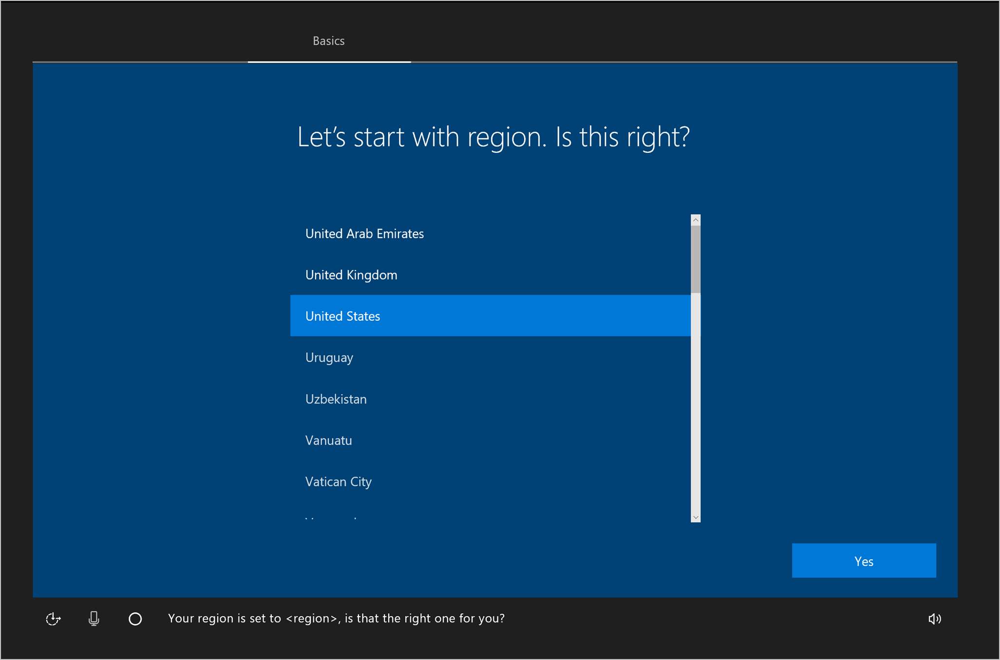
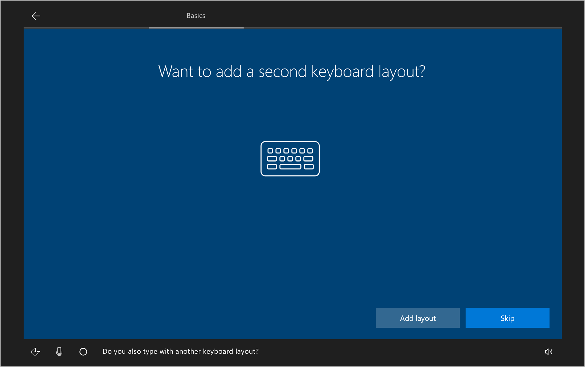
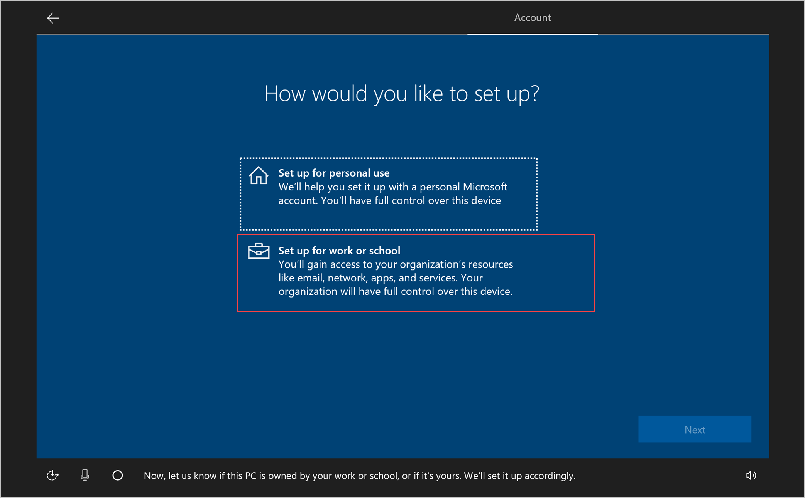
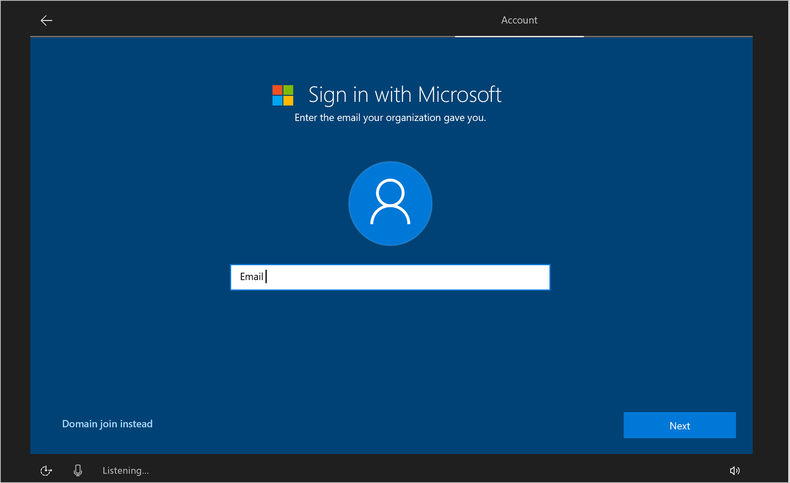
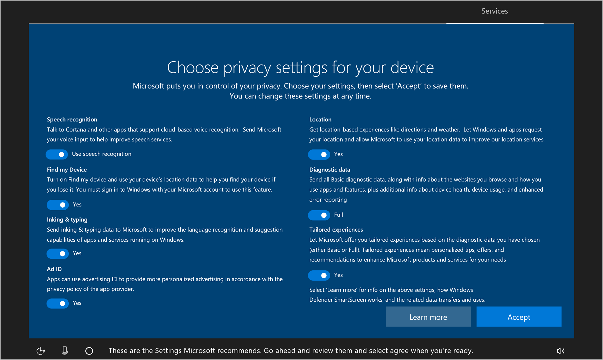
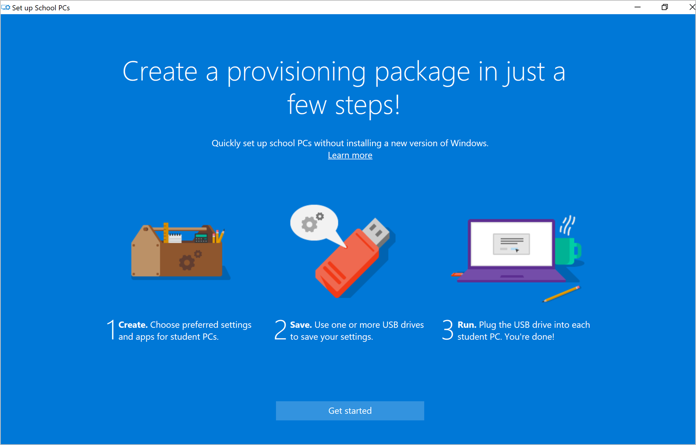

---
# required metadata

title: Add devices
titleSuffix: Intune for Education
description: Learn how to set up Windows 10 devices for Intune for Education.
keywords:
author: lenewsad
ms.author: lanewsad
manager: dougeby
ms.date: 06/18/2019
ms.topic: article
ms.prod:
ms.service: microsoft-intune
ms.technology:
ms.assetid: c884df47-61a9-4799-a407-8cd311d376d1
searchScope:
 - IntuneEDU

# optional metadata

#ROBOTS:
#audience:
#ms.devlang:
#ms.reviewer: travisj
#ms.suite: ems
#ms.tgt_pltfrm:
#ms.custom: intune-education

---

# Add Windows devices

After you've set up Intune for Education with your information — such as student records, apps, and settings for devices — connect the devices to Intune for Education. For new Windows 10 devices, a connection is established during initial device setup.   

## Set up devices with Windows Autopilot
[Windows Autopilot](https://docs.microsoft.com/intune/enrollment-autopilot) is compatible with Intune for Education, but it has to be set up in Intune in the Azure portal. To set up your devices with Autopilot, go to [Intune](https://portal.azure.com) > Device enrollment > Windows enrollment > Devices.  

## Before you begin
During setup, devices must have access to the Internet. 

## Windows device setup
Complete the following steps to add your Windows 10 devices to Intune for Education.

1. Power on the new Windows 10 device. 
2. On a new or reset device, the first setup screen reads, **Lets start with region. Is this right?** Select the region where your PCs are located. Then select **Yes**.  

     

3. Choose a keyboard layout. This step configures the onscreen keyboard to match your keyboard's physical layout. It also configures language and keyboard characters. Select **Yes** to continue.  

        

4. If you want to add another keyboard layout, select **Add layout**. Otherwise, select **Skip**.   

       

5. Select **Set up for work or school**. Then select **Next**.  

       

6. Type the email address associated with your school's admin or enrollment manager account. Then select **Next**.  

       

7. Enter the password for the account. Then select **Next**.  

       

8. Choose privacy settings for the device. Configure these settings based on your school's policies. Some of the settings, such as **Speech recognition** and **Location** are turned on by default.  

       

9. Select **Accept** to finish device setup. It might take a few minutes to complete setup, so feel free to begin setup on another device.  

## Set up devices with Set up School PCs app
Add Windows devices to Intune through the Set up School PCs app. The app walks you through how to configure and save a single device profile that you can distribute to multiple PCs. A USB drive is used to save and download the profile to each device during device setup. 

For more information about the app, see the [What is Set up School PCs?](https://docs.microsoft.com/education/windows/use-set-up-school-pcs-app) article. 

     

 
