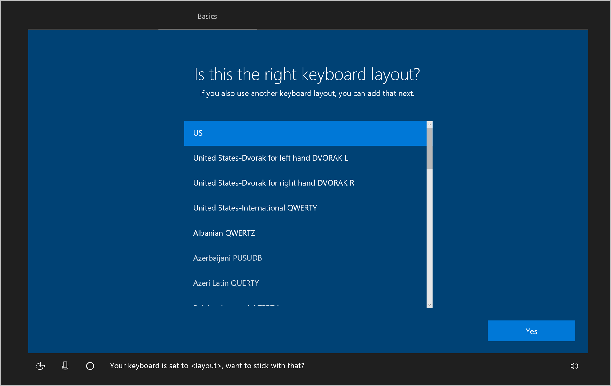
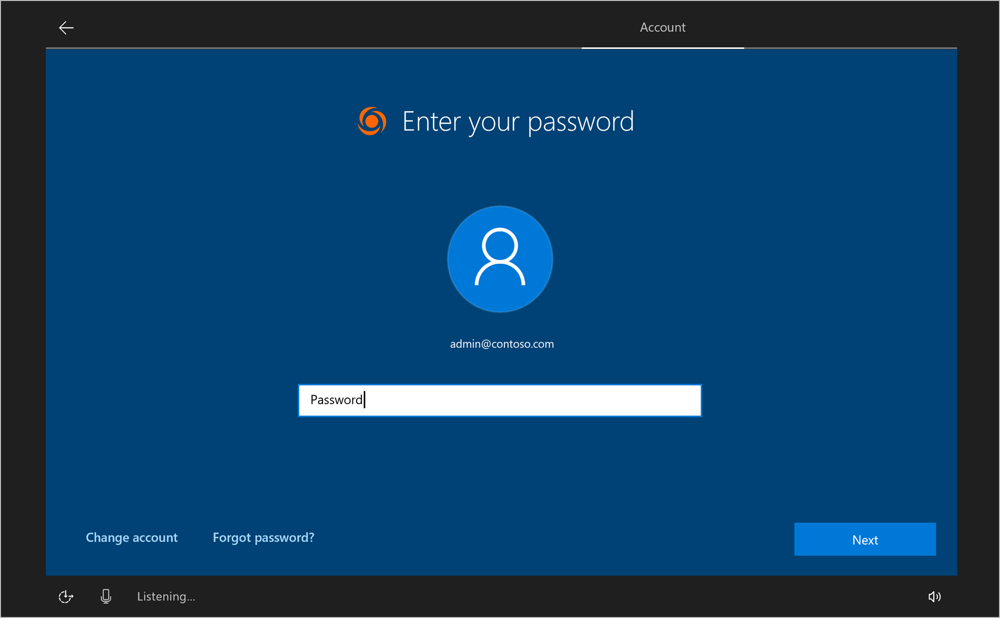

---
# required metadata

title: Enroll Windows 10 devices
titleSuffix: Intune for Education
description: Learn how to set up Windows 10 devices for Intune for Education.
keywords:
author: lenewsad
ms.author: lanewsad
manager: dougeby
ms.date: 06/18/2019
ms.topic: article
ms.prod:
ms.service: microsoft-intune
ms.technology:
ms.assetid: c884df47-61a9-4799-a407-8cd311d376d1
searchScope:
 - IntuneEDU

# optional metadata

#ROBOTS:
#audience:
#ms.devlang:
#ms.reviewer: travisj
#ms.suite: ems
#ms.tgt_pltfrm:
#ms.custom: intune-education

---

# Enroll Windows 10 devices

After you've set up Intune for Education with your information — such as student records, apps, and settings for devices — connect the devices to Intune for Education. For new Windows 10 devices, a connection is established during initial device setup.   

## When to use Set up School PCs vs Windows Autopilot  
The following table describes when to use Set up School PCs, Windows Autopilot, or both for initial device setup. Use the **Points to consider** column to consider your own school's environment and setup needs.  

|Points to consider| Set up School Pcs |Windows Autopilot  |
|---------|---------|---------|  
|IT staff | IT staff performs device unboxing, first power-on, and configuration of devices is performed by the IT Staff.|Optimized for limited engagement from IT staff. Students and teachers can perform device unboxing, first power-on, and initial configuration.|
|Device user|  Best for shared devices and for younger students.|Best for 1:1 devices and for older students.|
|Apps     | Best for deploying large apps simultaneously on a slower network.|Works well with apps of all sizes.| 
|Network | Reliable internet connection required; best for low-bandwidth networks.| Reliable internet connection required; network bandwidth consumption based on number of concurrent device setups and size of required apps. Students can setup devices on their home network.|
|First day of class|Devices are ready for sign in and use immediately.| Students need to unbox and connect to network; setup completes automatically.|
|Deployment time|Can take as little as 1-2 minutes; time increases based on the number of concurrent device setups, network bandwidth, and size of required applications.|Can take as little as 1-2 minutes; time increases based on the number of concurrent device setups, network bandwidth, and size of required applications.|
|OEMs/Partners|Not applicable.  |Requires registration of device IDs for the Windows Autopilot service by a partner (CSP) or OEM provider. |
|Existing on premises configuration| Supported with Windows Configuration Designer only. | Supports Hybrid AD join; device must be on same network as Active Directory Domain Controller.|  
### Setting up devices with Windows Autopilot
 To set up your devices with [Autopilot](https://docs.microsoft.com/windows/deployment/windows-autopilot/windows-autopilot-requirements), go to [Intune](https://devicemanagement.microsoft.com) > **Device enrollment** > **Windows enrollment** > **Devices**.   

### Setting up devices with Set up School PCs app
Add Windows devices to Intune through the Set up School PCs app. In the app, you'll create a configuration profile with settings and apps, save it to a USB drive, and distribute it to multiple PCs during device setup. 

For more information about the app, see the [What is Set up School PCs?](https://docs.microsoft.com/education/windows/use-set-up-school-pcs-app) article. 

## Set up Windows devices  
Complete the following steps to add your Windows 10 devices to Intune for Education. During setup, devices must have access to the internet. 

1. Power on the new Windows 10 device. 
2. On a new or reset device, the first setup screen reads, **Lets start with region. Is this right?** Select the region where your PCs are located. Then select **Yes**.  

     

3. Choose a keyboard layout. This step configures the onscreen keyboard to match your keyboard's physical layout. It also configures language and keyboard characters. Select **Yes** to continue.  

        

4. If you want to add another keyboard layout, select **Add layout**. Otherwise, select **Skip**.   

       

5. Select **Set up for work or school**. Then select **Next**.  

       

6. Type the email address associated with your school's admin or enrollment manager account. Then select **Next**.  

       

7. Enter the password for the account. Then select **Next**.  

       

8. Choose privacy settings for the device. Configure these settings based on your school's policies. Some of the settings, such as **Speech recognition** and **Location** are turned on by default.  

       

9. Select **Accept** to finish device setup. It might take a few minutes to complete setup, so feel free to begin setup on another device.  

## Next steps
Now that devices are set up and ready for school use, learn how to update, monitor, and troubleshoot them.   
* Assign [group admins](group-admin-delegate.md) to help you manage classroom settings within your school or across the district
* Review all [Windows settings](all-edu-settings-windows.md) that you can adjust
* Learn how [settings inheritance](settings-inheritance.md) affects new groups
* Review [reports](what-are-reports.md) to pinpoint and troubleshoot errors  

 
