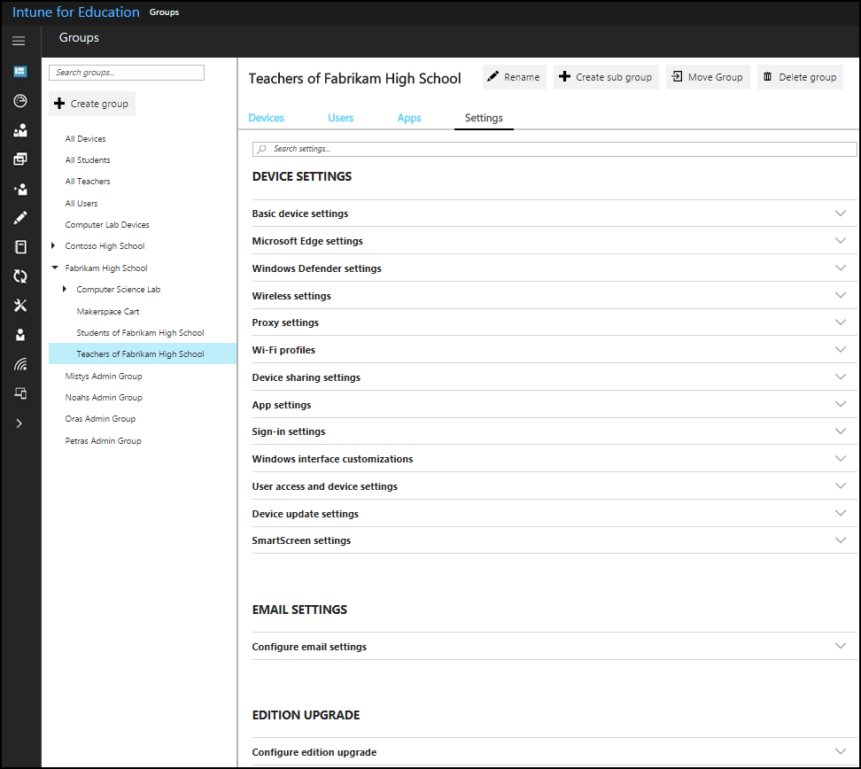

---
# required metadata

title: Available settings
titleSuffix: Intune for Education
description:
keywords:
author: barlanmsft
ms.author: barlan
manager: angrobe
ms.date: 04/17/2017
ms.topic: article
ms.prod:
ms.service:
ms.technology:
ms.assetid: 2221009e-68cf-4171-8118-0d750b0f35f1
searchScope:
- IntuneEDU

# optional metadata

#ROBOTS:
#audience:
#ms.devlang:
ms.reviewer: tanmayb
#ms.suite: ems
#ms.tgt_pltfrm:
#ms.custom:

---

# Available settings for Intune for Education

Managing settings is one of the key ways you can secure your Windows 10 devices and create the right kinds of access to enhance the learning experience. Intune for Education provides many settings that allow you to customize these experiences, both for individual groups and their subgroups.

Most settings are set up to either **Block** or **Allow** access to a certain device feature, where **Not configured** is the device's default setting or a user-chosen setting.

> [!NOTE]
> These user, app, and device settings differ from [tenant settings](tenant-settings.md).

You can find these settings by first selecting a **group**, then choosing **Settings**.

  

Much of the information in the **What it does** column can also be found in the Intune for Education console; this format is designed to make it easier for you to search through the settings for specific items.

## Basic device settings

|Setting|What it does|
|---|---|
|Camera|Block user access to the device camera.|
|Removable storage|Block users from using removable storage such as USB drives and external hard drives.|
|Date and time|Block users from changing the device date and time settings.|
|Device name|Block users from changing the device name.|
|Language settings|Block users from changing the device language.|
|Unenroll devices|Block users from manually unenrolling devices from management.|
|Send diagnostic data|Define whether to collect and send anonymous usage data to Microsoft to help improve Windows.|
|Add provisioning packages|Block users from adding add new provisioning packages containing device configuration settings.|
|Remove provisioning packages|Block users from removing provisioning packages containing device configuration settings.|
|Location services|Block apps from using location services to access the device’s location.|
|Internet Sharing|Block users from using Internet Sharing to share the device’s Internet connection.|
|Cortana|Block Cortana, the digital assistant built into Windows 10 that can answer questions and perform tasks.|
|Device region settings|Block users from changing region settings, such as country and language.|
|Save files to local hard drive|Block users from saving files locally.|
|Power and sleep settings|Block users from changing power and sleep settings.|
|Start menu size|Define whether to force the Start menu to appear full screen.|
|Windows Spotlight|Block all Windows Spotlight features on these devices.|
|OneDrive Sync|Block OneDrive Sync for these devices and users.|

## Microsoft Edge settings

|Setting|What it does|
|---|---|
|Pop-ups|Block websites from opening new windows.|
|Do-Not-Track headers|Require Microsoft Edge to ask that websites not track user data.|
|Cookies|Cookies can store website settings or track user’s browsing behavior.|
|Automatically fill form entries|Block saving data entered in a form field online.|
|Password manager|Block users from using the password manager to save passwords.|
|Developer tools|Block users from accessing developer tools.|
|Browser extensions|Block users from using extensions to customize Edge with added functionality from Microsoft and other sources.|
|InPrivate browsing|Block users from using InPrivate browsing, which stops Edge from saving data like browsing history and cookies.|
|Access to about:flags page|Block access to the about:flags page, which contains experimental settings and features.|
|SmartScreen override|Block users from ignoring warnings about websites blocked by the SmartScreen Filter.|
|SmartScreen override for files|Block users from ignoring SmartScreen Filter warnings about downloading unverified files.|
|Block adult content using a strict SafeSearch filter|Setting to “Block” will use a strict rather than moderate SafeSearch filter to block adult content.|
|Search suggestions|Block Edge from suggesting possible websites as you type a URL or search term.|
|Intranet traffic in Internet Explorer|If set to “Block”, internal traffic will be sent to Edge instead of Internet Explorer.|
|JavaScript|Block JavaScript from running in Edge.|
|Default search engine|Select Bing, Yahoo, or Google as the default search engine for Microsoft Edge. If you or another admin has set up a custom search engine in the full Intune experience, you can define that custom search engine as the default here.|
|Configure Microsoft Edge homepages|Choose what homepages open every time someone begins a new session browsing with Microsoft Edge.|
|Configure Microsoft Edge favorites|Choose websites to appear in the Microsoft Edge favorites list.|
|Block editing favorites|Block users from editing Edge browser favorites.|

## User access to device settings

|Setting|What it does|
|---|---|

## Device update settings

|Setting|What it does|
|---|---|

## Windows Defender settings

|Setting|What it does|
|---|---|

## Wireless settings

|Setting|What it does|
|---|---|

## Device sharing settings

|Setting|What it does|
|---|---|

## App settings

|Setting|What it does|
|---|---|

## Sign-in settings

|Setting|What it does|
|---|---|

## Windows interface customizations
|---|---|

## Email settings

Choose whether email settings are configured for this group.

## Edition upgrade

Allows you to specify whether devices are upgraded to a particular edition of Windows 10 and assign a **Product key**.

## Find out more

- [Find out more about the full Windows 10 settings management experience available in Intune](https://docs.microsoft.com/intune/deploy-use/windows-10-policy-settings-in-microsoft-intune)
