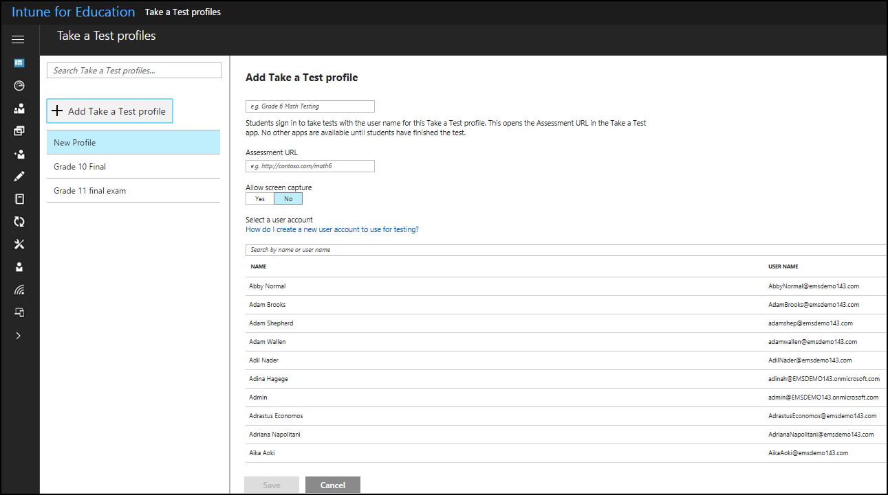

---
# required metadata

title: Take a Test profiles
titleSuffix: Intune for Education
description: Learn how to use Take A Test profiles to administer and capture student test results.
keywords:
author: lenewsad
ms.author: lanewsad
manager: dougeby
ms.date: 07/23/2018
ms.topic: article
ms.prod:
ms.service: microsoft-intune
ms.technology:
ms.assetid: 3ad65b15-015a-402e-9dd5-0748dee79459
searchScope:
- IntuneEDU

# optional metadata

#ROBOTS:
#audience:
#ms.devlang:
#ms.reviewer: rashok
#ms.suite: ems
#ms.tgt_pltfrm: 
#ms.custom: intune-education

---

# Add a Take a Test profile in Intune for Education

The Take a Test app lets you securely administer online tests on your classroom's Windows 10 devices.  Students use the credentials you provide for them to sign in to the test profile. Then they click the assessment URL to launch the test. 
 
This article describes how to:
* Create a Take a Test profile.
* Assign the profile to students in your school.  

> [!NOTE]
> Create an exclusive user for Take a Test purposes. Assign your Take a Test profile to this user so that you don't impact student or teacher devices. Learn how to assign a user in the Windows 10 for Education, [Set up Take a Test on multiple PCs](https://technet.microsoft.com/edu/windows/take-a-test-multiple-pcs) article.

## Take a Test features
When a student launches a test, their desktop locks. The Take a Test app opens in a new window. Take a Test clears the system's clipboard so that students can't copy and paste content.

While a test is active, test takers cannot:

* Visit other websites.
* Open or access other apps.
* Change settings.
* Extend the display.  
* See notifications.
* Receive app and OS updates.
* Receive text suggestions.
* Use Cortana.
* Share, print, or record device screens, unless allowed by school or IT administrator.

### How is assistive technology affected?
Some device features--such as narrator--and other assistive technology are still fully functional while taking a test. For a list of the apps features, see [Take a Test app technical reference](https://docs.microsoft.com/en-us/education/windows/take-a-test-app-technical).

## Take a Test profile setup
Set up a profile in Intune for Education. Before you begin, we recommend that you create a dedicated user account used solely for assessments. Users will sign in to this account to access tests. 

1. From Intune for Education dashboard, click **Take a Test profiles**.    

2.  Click Add Take a Test profile.  
 
3. Enter a descriptive name for the test.  
4 Enter the Assessment URL.  
 
5. Configure the rest of the test settings:    
    a. Allow screen capture  
    b. Require PCs to have a printer installed  
    c. Allow text suggestions  
6 Select an account from your list of existing users. Students will use the account's username and password to sign in to the appropriate assessment.  

To view the details of any profile, select it from the left side of the page. Then click the **Account** tab.  

## Assign or change groups
Assign groups of students that require access to the test profile. Follow these steps to make edits to group assignments too.
1. From the **Take a Test profiles** page, click the **Groups** tab. 
2. Click **Change group assignments**. 
3. Select one or more groups from the **All Groups** menu. Then click **Add Groups**. 
4. To remove a group from the assignment, select the group from the **Groups assigned** menu. Then click **Remove Groups**.
5. Click **Ok** to submit your changes.

## Delete Take a Test profile  
When you delete a Take a Test profile, it becomes a typical user account. Students are still able to sign in to the account with its existing credentials, but the URL assessment link is removed from the account. Signing into the account will also no longer lock student devices.

1. From the **Take a Test profiles** page, choose the profile you want to delete.
2. Click **Delete Take a Test profile**.
3. Click **Delete** to confirm your action.

- To find out more about Take a Test on your devices, see [Take a Test in Windows 10](https://technet.microsoft.com/edu/windows/take-tests-in-windows-10).
