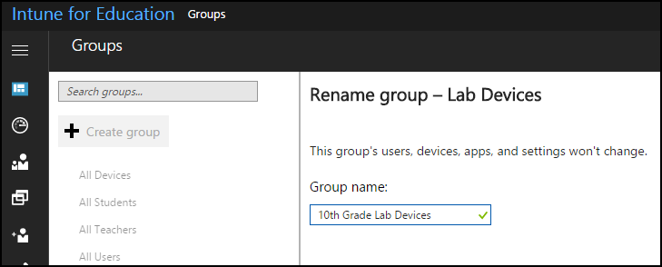

---
# required metadata

title: What are groups?
titleSuffix: Intune for Education
description: Learn how to manage groups of devices with Intune for Education.
keywords:
author: barlanmsft
ms.author: barlan
manager: angrobe
ms.date: 04/25/2017
ms.topic: article
ms.prod:
ms.service:
ms.technology:
ms.assetid: 4b570196-a640-4d13-8e01-8e8553ce1468
searchScope:
- IntuneEDU

# optional metadata

#ROBOTS:
#audience:
#ms.devlang:
ms.reviewer: tanmayb
#ms.suite: ems
#ms.tgt_pltfrm:
#ms.custom:

---

# What are groups?

Intune for Education uses _groups_ to manage users and devices. You can group users or devices together instead of having to manage each device individually. This lets you assign apps and settings to small or large groups.

When you create groups, consider how you will apply the settings and apps to users and devices. For example, you may need to apply a basic password requirement across all devices, while only students taking [AP Computer Science](https://www.tealsk12.org) might need the Java SE Development Kit.

Intune for Education provides a set of default groups when your tenant is created. These default groups represent the broadest categories of users and devices in your school or school district. A few default groups that Intune for Education provides cannot be modified. You can, however, rename, move or delete the groups as needed.

## Create a new group

**To create a new group**

  

1.	In the [Intune for Education portal](https://intuneeducation.portal.azure.com), choose **Manage Groups**.  The **Groups** blade opens.
2.	Select **Create Group**.
3.	Enter a **Group Name**.
4.	Click **Create Group**.

## Create a subgroup
You can create subgroups under any group except certain default groups, like __All Devices__ or __All Users__. Subgroups are useful to refine the organization of device users.  For example, you could create a **Science class** subgroup under **Sixth grade students** to help provide apps for those classes.

  

1.	In the [Intune for Education console](https://intuneeducation.portal.azure.com), choose **Manage user and device groups**.  The **Groups** blade opens.
2. Select the group beneath which you want to create a subgroup.
3.	Click **Create subgroup** either in the ellipses menu or in the task list.
3.	Enter the **Group Name**.
4.	Select **Create Group**.
5.	Subgroup appears under the group you selected.

> [!NOTE]
> It's possible that you'll have some groups that don't work within the structure you've set up. You can find out how to manage these kinds of exceptions in our [core concepts article](core-concepts.md#what-is-group-inheritance).

## Edit group membership
After you've created a group, it's possible that you'll need to edit the membership - for example, if a student transfers to another school in your district and that student will take their device with them to that school.

  

1.	In the [Intune for Education portal](https://intuneeducation.portal.azure.com), choose **Manage Groups**.  The **Groups** blade opens.
2. Select the group whose device membership you want to edit.
3. Click the **Devices** tab.
4. Click the **Edit devices** button.
5.	Select the appropriate option:
  - Click **Add Devices** to add more devices from a list
  - Click **X** next to a device to delete a device

  Click **OK** to save your changes.

## Rename a group

  

1.	In the [Intune for Education portal](https://intuneeducation.portal.azure.com), choose **Manage Groups**.  The **Groups** blade opens.
2. Select the group that needs to be renamed.
3.	Click **Rename** either by clicking the **Rename** button or in the ellipses menu.
4.	Enter the new **Name**.
5.	Select **OK** to save your changes.

## Move a group

You can move a group within your group structure, or **hierarchy**.

  

1.	In the [Intune for Education portal](https://intuneeducation.portal.azure.com), choose **Manage Groups**.  The **Groups** blade opens.
2. Select the group that needs to be Moved
3.	Click **Move group** either in the menu list or by chooseing **Move group** button.
4.	Select the group location to which you want to move the group by either searching a group name or by selecting it in the hierarchy.
5.	Select **OK** to save your changes.

> [!NOTE]
> If the group you selected is a member of more than one group, moving that group [removes it from all other groups](why-cant-i-move-this-group.md).

## Delete a group
When you delete a group, Intune for Education removes the collection of apps and settings on any device that is a member of that group. Deleting a group will not remove those users or devices from management.

  

1.	In the [Intune for Education portal](https://intuneeducation.portal.azure.com), choose **Manage Groups**.  The **Groups** blade opens.
2. Select the group you want to delete
3.	Click **Delete group** either in the ellipses menu or task list.

## Find out more

- [Find out more about the full groups experience in Intune](https://docs.microsoft.com/intune/deploy-use/use-groups-to-manage-users-and-devices-with-microsoft-intune)
