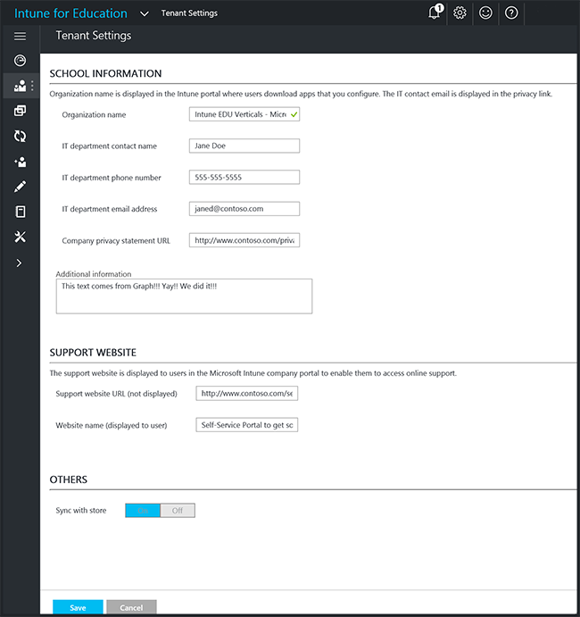

---
# required metadata

title: What are tenants?
titleSuffix: Intune for Education
description: Learn how to manage your tenant with tenant-wide settings.
keywords:
author: barlanmsft
ms.author: barlan
manager: angrobe
ms.date: 04/25/2017
ms.topic: article
ms.prod:
ms.service:
ms.technology:
ms.assetid: 50bd115f-a167-456a-910d-8f31ec17a422
searchScope:
 - IntuneEDU

# optional metadata

#ROBOTS:
#audience:
#ms.devlang:
#ms.reviewer:
#ms.suite: ems
#ms.tgt_pltfrm:
#ms.custom:

---

# What are tenants?

Your _tenant_ is your organization's individual instance of Intune for Education. Think of it like logging into the Office 365 Outlook Web App to get your email. When you log in, it just shows your information, but when one of your colleagues logs in, it just shows their information. The IT admin for Office 365 can manage certain settings for all users, like showing a custom logo or a school's colors.  

When you modify tenant settings, you are modifying settings across your entire subscription and all of your licenses.

## How do I manage tenant-wide settings in Intune for Education?

Certain settings affect all users and devices you have under management. Intune for Education refers to these as **tenant settings**. Only Intune for Education admins can see or change these settings.

To manage these settings, choose **Tenant settings** in the left-side navigation bar in the [Intune for Education](https://intuneeducation.portal.azure.com) console.

  

These settings include __IT contact information__, such as who is the __IT department contact__, their __phone number__, and __email address__. It is also where you will define your organization's __privacy statement URL__.

  

Tenant settings is also where you are able to force a sync between Intune for Education and Microsoft Store for Business if app purchases are taking too long to appear in Intune for Education.

## Certificate management

Tenant admins can give users secured access to resources through VPN or Wi-Fi with _certificates_. However, certificate management is not available from the Intune for Education portal. Instead, you will need to use the full Intune portal. Find out more about the [full experience managing certificates with Intune](https://docs.microsoft.com/intune/deploy-use/secure-resource-access-with-certificate-profiles).

## Troubleshooting

Errors in the Intune for Education portal are reported in a notification tab at the top right of the Intune for Education console. An error message appear typically includes a description and an error code. To view a list of recent errors and notifications, choose the bell icon at the top-right of the Intune for Education console.

## Find out more

- [Find out more about the full experience managing certificates with Intune](https://docs.microsoft.com/intune/deploy-use/secure-resource-access-with-certificate-profiles)
- [Find out about the full experience troubleshooting with Intune](https://docs.microsoft.com/intune/troubleshoot/general-troubleshooting-tips-for-microsoft-intune)
