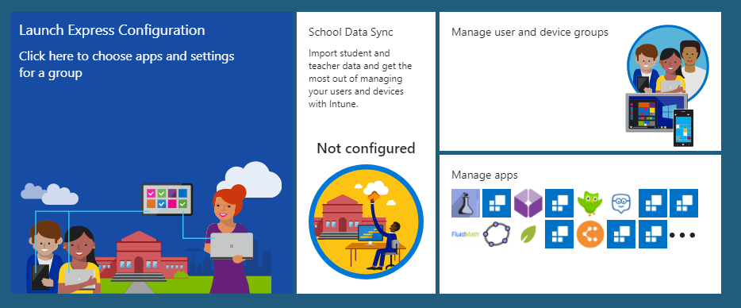

---
# required metadata

title: What is Intune for Education?
titleSuffix: Intune for Education
description: Learn about Intune for Education and how how you can manage iOS and Windows devices in an educational environment.
keywords:
author: lenewsad
ms.author: lanewsad
manager: dougeby
ms.date: 10/03/2018
ms.topic: article
ms.prod:
ms.service: microsoft-intune
ms.technology:
ms.assetid: c66e1700-aac0-44c0-af89-d5d9d4fac9ae
searchScope:
- IntuneEDU

# optional metadata

#ROBOTS:
#audience:
#ms.devlang:
#ms.reviewer: travisj
#ms.suite: ems
#ms.tgt_pltfrm:
#ms.custom: intune-education

---

# What is Intune for Education?

Microsoft Intune for Education is a cloud-based, mobile device management (MDM) service for schools. It helps your teachers and students stay productive on classroom devices, and keeps school data secure. 

With Intune for Eduction you can:
* Manage the desktop and mobile devices students use to access classroom data.
* Configure and assign the apps students use in the classroom.
* Control how students and teachers access and share classroom information.
* Apply school security requirements to devices and apps.

The Intune for Education portal is simply designed to include only the settings and workflows you need to manage iOS and Windows school devices. From the portal, you can view and take action on your device, user, and app inventory. Intune for Education also supports the Take a Test app, which allows teachers to assess student progress directly from classroom devices.  

## Sign up for Intune for Education
If you're not already signed up with an Intune for Education account, learn [how to get started](https://docs.microsoft.com/intune/account-sign-up). The article is for system administrators who are ready to sign their school up for an Intune subscription. 

## Manually add users to you Intune subscription
If you're not using the Microsoft School Data Sync (SDS) service to import student and teacher records, you must [manually add users to your Intune subscription](https://docs.microsoft.com/intune/users-add). Students and teachers can be added through the Azure portal or through the Office 365 portal. At the time of user setup, you'll also want to grant admin permissions. 

## Supported OS and browsers
The full Intune management service supports many device operating systems. For school settings, like yours, we recommend using Intune for Education. Its portal is set up to specifically support Windows 10 and iOS school devices.  

To view a complete list of Intune-supported web browsers and operating systems, see [Supported operating systems and browsers](https://docs.microsoft.com/intune/supported-devices-browsers) in the Microsoft Intune documentation.  

## Configuring your Intune for Education tenant
*Tenant* refers to your organization's instance of Intune for Education. Settings at a tenant-level affect your organization's Intune subscription. Intune for Education has both **General** settings and **iOS Device Management** tenant settings. 

### General settings
The **General** page of tenant settings asks for your school's IT contact and resource information. Most of this information is optional but is useful to provide an IT point of contact for students and faculty.  For more information about editing general settings, see [Edit general settings](edu-tenant-general-settings.md). 

### iOS Device Management settings  
**iOS Device Management** settings ask for information about your Apple accounts. These settings are a requirement for organizations who wish to manage their iOS devices in Intune. Until you configure device management for iOS, you can't see or manage iOS-related settings in the Intune for Education portal.

For more information about setting up your device's iOS device management settings, see [Setup iOS device management](setup-ios-device-management.md).

Only [delgated admins](group-admin-delegate.md) in Intune for Education are allowed to see and change tenant settings.

## Does Intune for Education work on shared devices?  
Intune for Education works with shared devices, and supports the management of multiple users on a single device. Students who share a device may have different apps and settings targeted to them. When students sign in to a device, they'll see only the apps and settings assigned specifically to them.  

## Compatible resources and tools

You'll have access to other Microsoft management tools:
* Microsoft Intune in the Azure portal, the [full device, app, and user management experience](https://docs.microsoft.com/intune/understand-explore/introduction-to-microsoft-intune)
* Microsoft Azure Active Directory (Azure AD), [the identity and access management system](https://docs.microsoft.com/azure/active-directory/active-directory-administer)
* [Microsoft School Data Sync](https://sds.microsoft.com)
* [Office 365 for  Education](https://support.office.com/article/Get-started-with-Office-365-Education-AB02ABE5-A1EE-458C-B749-5B44416CCF14)

Use Intune for Education with [Microsoft Education](https://docs.microsoft.com/education/#pivot=itpro) tools such as:

- [Office 365 for Education](https://support.office.com/article/Set-up-Office-365-for-business-6a3a29a0-e616-4713-99d1-15eda62d04fa)
- [Windows 10 for Education](https://docs.microsoft.com/education/windows)
- [Microsoft Store for Education](https://docs.microsoft.com/microsoft-store/index?toc=/microsoft-store/education/toc.json)
- [Minecraft: Education Edition](https://docs.microsoft.com/education/windows/school-get-minecraft)

> [!VIDEO https://www.youtube.com/embed/ukrnCwcLvV8]

## Get started with Intune for Education
Import student records with Microsoft School Data sync. Configure school's Windows devices with the Set up School PCs app, or sign in to [Intune for Education](https://intuneeducation.portal.azure.com) to set up Apple management for your iOS devices.

From the [dashboard](how-do-i-customize-my-dashboard.md), launch [Express Configuration](Express-configuration-intune-edu.md). Select a user or device group (such as students, teachers, or _2nd floor Computer Lab_) and start assigning apps and settings.

